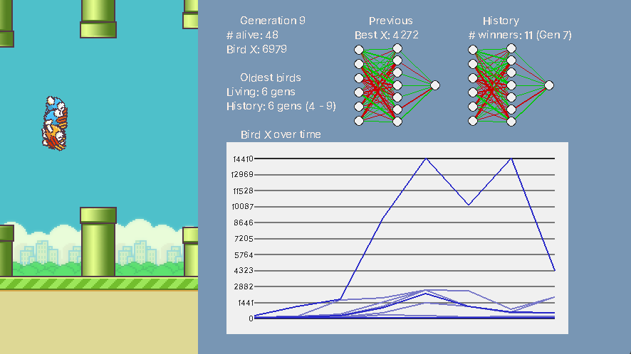

# flappy-bird-ai
This project implements a Flappy Bird AI using NeuroEvolution to simulate the process of natural selection.
The AI agent evolves over generations, spawning offsprings for best-performing birds and killing off birds that do not do well.

The goal of this project is to explore evolutionary learning from scratch, without involving external libraries such as NEAT Python.


## Features


* **Visualised interface**: Watch the population of birds pass through pipes in real time.
* **Genetic algorithms**: Using NeuroEvolution for evolutionary learning.
* **Statistics dashboard**: Demonstrates generation summaries, neural networks and history breakdown.
* **Accessible settings**: Easily tweak the controls for the simulation.


## Installation
1. Ensure you have Python installed on your system. (Python 3.6 or higher)

2. Clone this repository to your local machine using the following command:

`git clone https://github.com/lithonhong/flappy-bird-ai.git`

3. Navigate to the project directory:

`cd flappy-bird-ai`

4. Install the required dependencies.

`pip install -r requirements.txt`


## Usage
### Running the code
1. Run `game.py`. A window should pop up, and the simulation should automatically start.

2. A summary of each generation is printed onto the console. Example:
```
Gen 1 complete | Best: 231 | History best: 231 (gen 1)
Percentiles: 0.1: 144 | 0.25: 144 | 0.4: 144 | 0.5: 96 | 0.6: 96 | 0.75: 96 | 0.9: 96
Categorical scores: random: 96.0
```

3. Press **Space** to pause/resume the simulation.

4. After the window is closed, two files (`birds.csv` and `percentiles.csv`) containing data of the run are added to the directory (if it doesn't previously exist).

5. Modify controls settings in `settings.py`. Changes take place only after restarting the program.


### Project Structure
| File/folder        | Function |
| ------------------ | ------------- |
| `assets/`          | Image & font assets. |
| `documentation/  ` | Documentation and past experiment logs. |
| `game.py`          | Main game loop and simulation logistics. |
| `nnet.py`          | Neural network implementation. |
| `settings.py`      | Configurable parameters & constants. |
| `requirements.txt` | Dependencies for the program. |
| `README.md`        | You are here! |

After the window is closed, two files (`birds.csv` and `percentiles.csv`) containing data of the run are added to the directory.


## How the Project Works

### The neural network

Each bird is controlled by a simple feedforward network.

6 inputs are fed into the neural network:
1. The horizontal distance of the nearest pipe to the bird
2. The vertical distance of top pipe to the bird
3. The vertical distance of bottom pipe to the bird
4. The bird's vertical position
5. The bird's vertical velocity
6. Bias neuron (constant value of 1)

The inputs are then:
* modified by a list of weights via matrix multiplication,
* fed through an activation function (logistic sigmoid),
* passed into a set of hidden neurons (by default 7),
* multiplied by a second list of weights, and
* passed through a second layer of activation function.

The output determines if the bird should flap or do nothing.


### Evolution

Two modes of evolution is coded into the program: one-parent reproduction and two-parent reproduction.
The user is free to adjust the ratios of each type of evolution, however two-parent reproduction remains the intended method as it better simulates biology of human genes (and works better!).

After each generation, the population undergoes **evolution**:

1. **Selection**

The birds' performance is measured by **fitness**, in this case the distance travelled with a penalty of being imprecise and/or colliding with the pipes.

The best-performing birds get to "survive" into the next round without undergoing mutation.

Birds are selected to breed using a modified weight to give birds with higher fitness slight advantage.

2. **Crossover**

For two-parent reproduction, two parents "breed" to produce offspring inheriting neural network weights of the parents.
This stimulates production of new combination of genes that may perform better than the parents'.

Crossover does not occur in one-parent generation.

3. **Mutation**

Offspring neural network weights are offset by a small value.

With a slight probability, the offspring's neural network weight may undergo **full mutation**, obtaining a totally random value instead of inheriting from either parents.


## Foundings
The foundings of this project can be found [here](documentation/foundings.md).


## Contributing & Feedback
I'm deeply aware that this project is far from perfect—it's my introductory project to AI, after all.

If you have any comments regarding my code,
feel free to reach out by **opening an issue** in this repository!


## Credits
These websites were of great help during the development of the program.

* [Neural nets with Flappy and pygame, Bluefever Software](https://www.youtube.com/playlist?list=PLZ1QII7yudbebDQ1Kiqdh1LNz6PavcptO)

* [How I Built an Intelligent Agent to Play Flappy Bird, Danny Zhu](https://medium.com/analytics-vidhya/how-i-built-an-ai-to-play-flappy-bird-81b672b66521)

* [Assets to develop the Flappy Bird Game, Samuelcust](https://github.com/samuelcust/flappy-bird-assets/tree/master)

* [Pygame documentation](https://www.pygame.org/docs/)